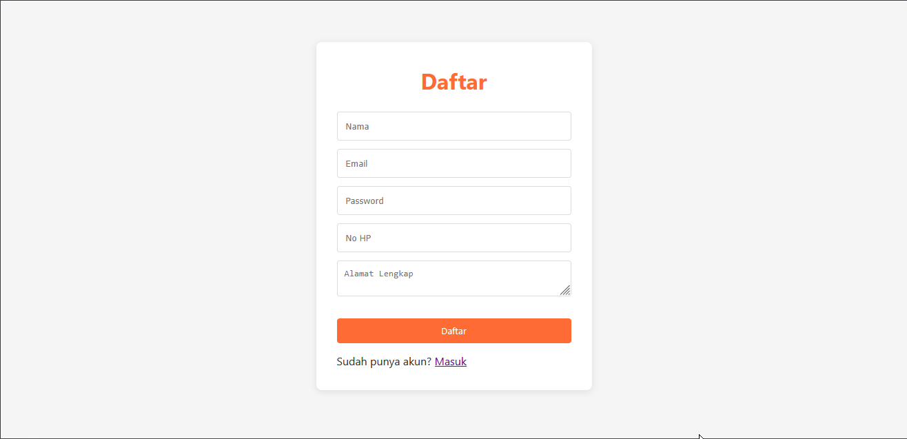
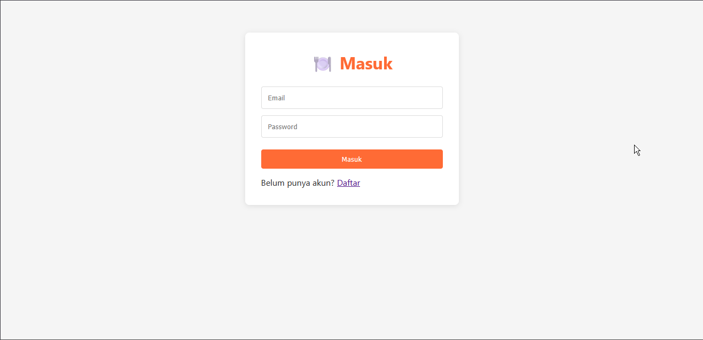
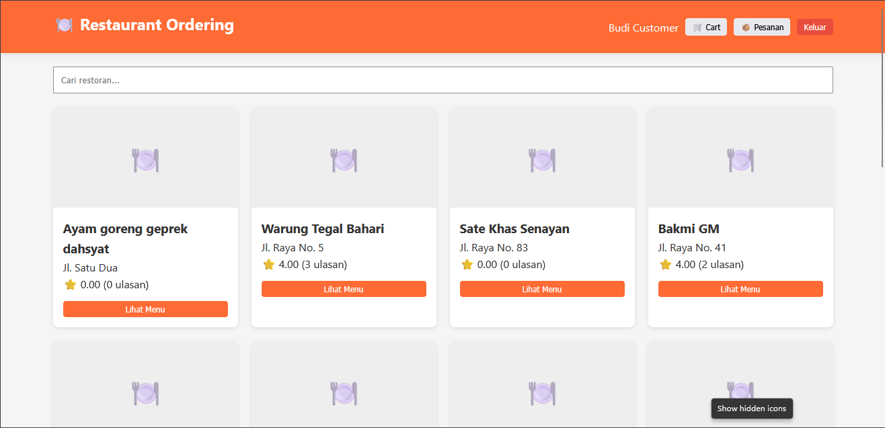
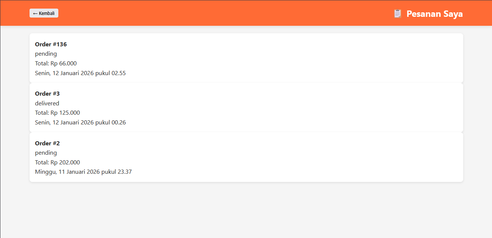
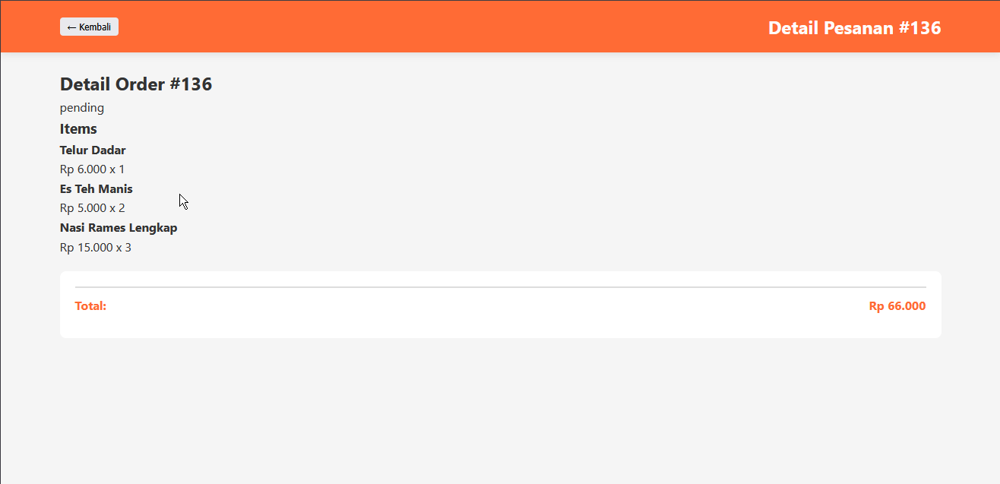
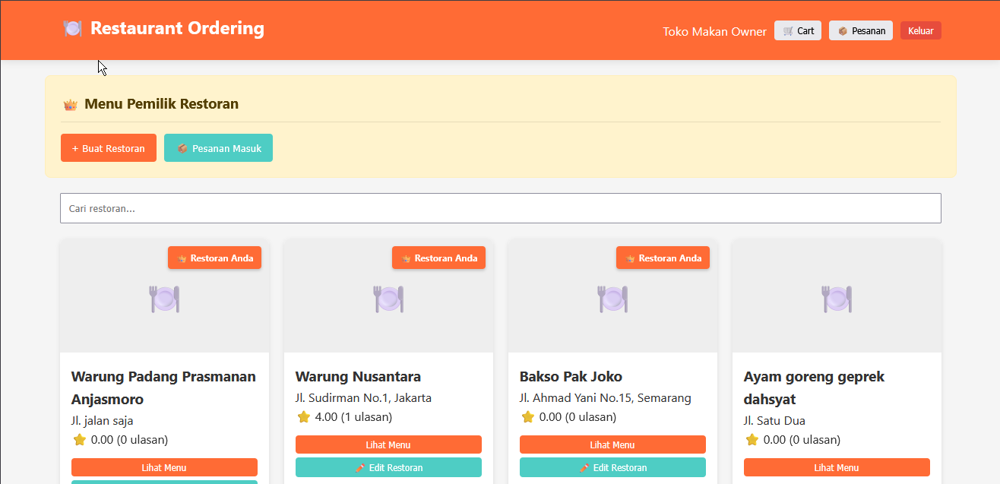
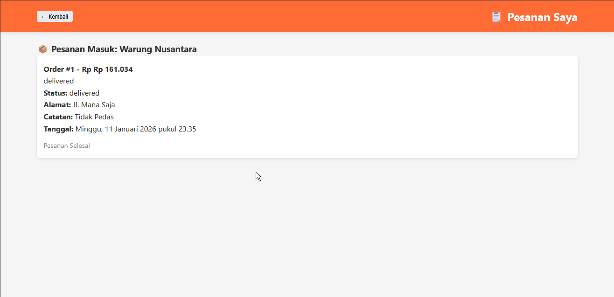
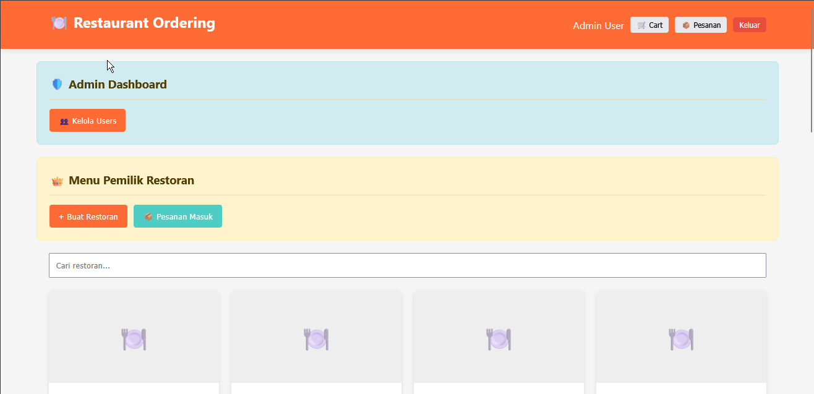

# README— Aplikasi Restoran & Pemesanan

Aplikasi ini adalah sistem pemesanan makanan sederhana berbasis **PHP (API)** + Frontend HTML/CSS/JS, mendukung login/register, browsing restoran, pemesanan, update status order, dan review restoran.

## Fitur Utama
- Autentikasi berbasis token (Bearer) untuk mengakses endpoint yang dilindungi.
- Register customer menyimpan data `name`, `email`, `password`, `phone`, dan `address`.
- Manajemen restoran (list, detail + menu, create/update restoran untuk owner).
- Pemesanan: buat order, lihat riwayat order, detail order, dan update status order.
- Review restoran per order + perhitungan rating rata-rata dan total review.

## Format Response API
Semua respons API menggunakan format JSON `success`, `message`, dan `data`.

## Struktur Folder
- `public_html/`
  - `index.html`
  - `css/style.css`
  - `js/app.js`
  - `js/api.js`
  - `js/utils.js`
  - `api/`
    - `config.php`
    - `functions.php`
    - `middleware.php`
    - `index.php`

## Konfigurasi
- Ubah koneksi database di `api/config.php` agar sesuai dengan kredensial MySQL hosting Anda.
- Pastikan frontend mengarah ke Base URL API yang benar

## Cara Menjalankan
1. Upload semua file ke hosting.
2. Import database lewat phpMyAdmin.
3. Akses `index.html`, lalu coba register/login.
4. Gunakan token dari login sebagai `Authorization: Bearer <token>` untuk akses endpoint yang membutuhkan autentikasi.

## Endpoint Penting
- `POST /auth/register` (dengan `address`)
- `POST /auth/login`
- `GET /restaurants`, `GET /restaurants/{id}`
- `POST /orders`, `GET /orders`, `GET /orders/{id}`
- `PUT /orders/{id}/status`
- `POST /orders/{id}/review`, `GET /restaurants/{id}/reviews`

## Catatan Keamanan
Password pada kode saat ini menggunakan hashing MD5, sehingga untuk production disarankan upgrade ke `password_hash()` / `password_verify()`.

## Tangkapan Layar
<table>
  <tr>
    <td align="center">
      
       
      Halaman Register
    </td>
    <td align="center">
      
       
      Halaman Login
    </td>
    <td align="center">
      
       
      Tampilan Dashboard User
    </td>
    <td align="center">
      
       
      Tampilan dari Restoran beserta menunya
    </td>
    <td align="center">
      
       
      Tampilan Orderan User
    </td>
    <td align="center">
      
       
      Detail Order User
    </td>
    <td align="center">
      
       
      Tampilan Dashboard Pemilik Restoran
    </td>
    <td align="center">
      
       
      Tampilan Proses Order dari pemilik Restoran
    </td>
    <td align="center">
      
       
      Tampilan Dashboard Admin
    </td>
  </tr>
</table>
